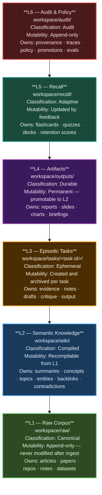
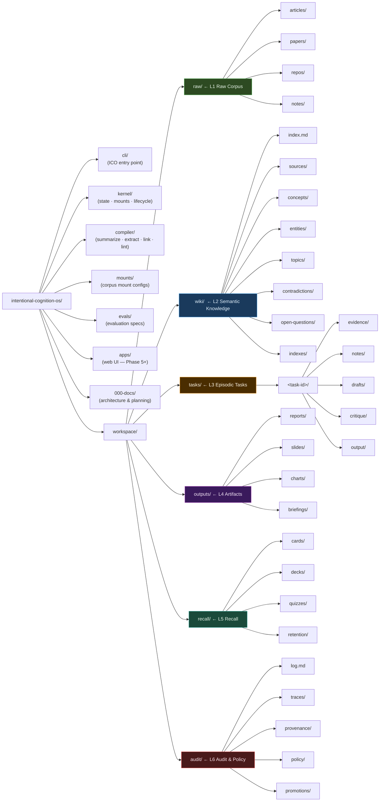
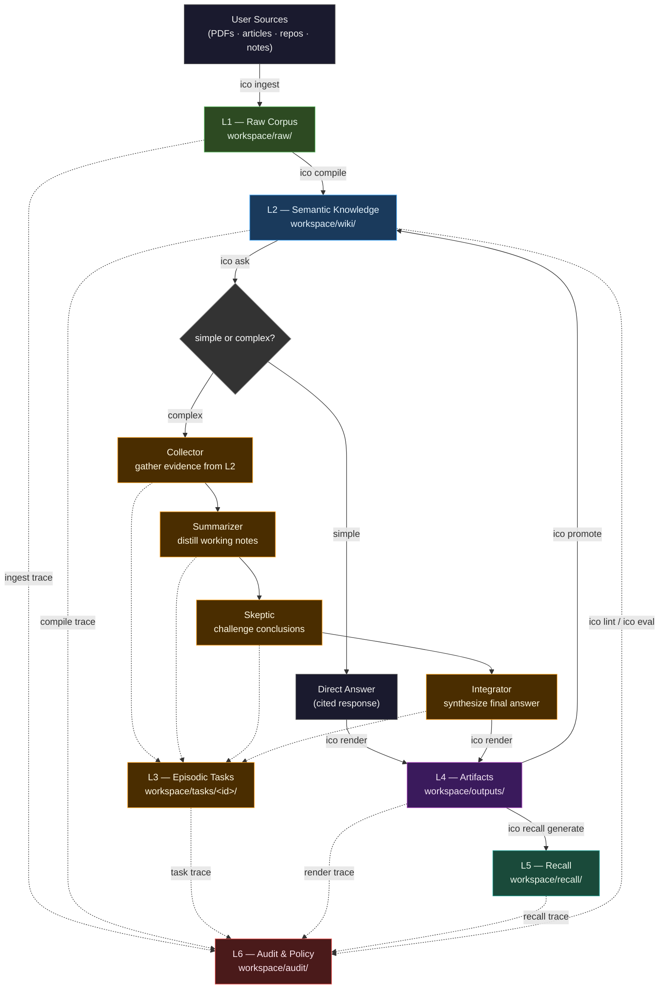
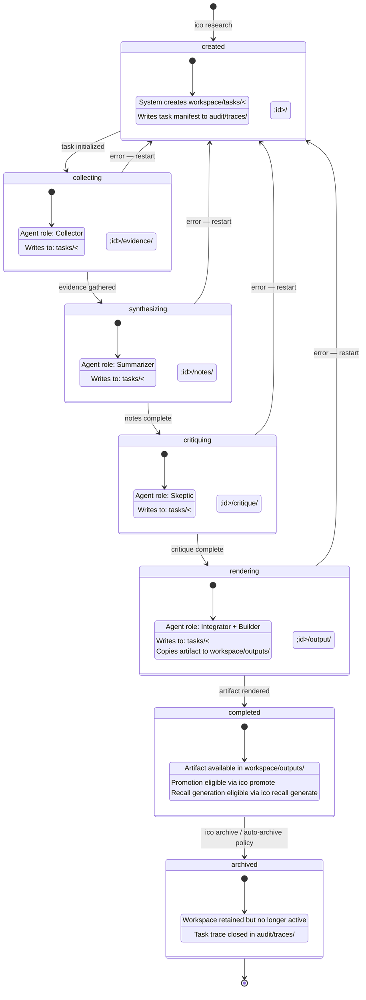
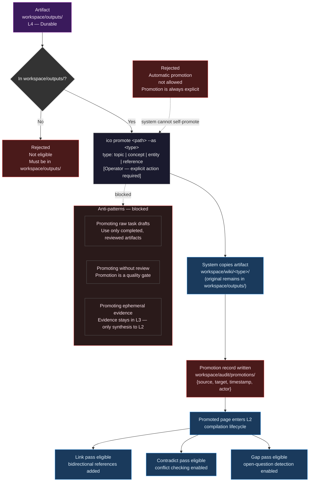

# Architecture Diagram Prompt Pack
> Six diagrams. Six perspectives on the same system.

**Author:** Jeremy Longshore — Intent Solutions
**Date:** 2026-04-06
**Version:** 1.0.0
**Status:** Frozen for Phase 1

---

These six diagrams cover the complete architecture of Intentional Cognition OS. Each entry provides a generation prompt, the expected Mermaid diagram code, and a description of what the diagram shows. Feed any prompt directly to an LLM to regenerate or extend the diagram.

Diagrams are ordered from structural (what the system is) to behavioral (what the system does).

---

## 1. Six-Layer Stack Diagram

**What it shows.** The six storage and responsibility layers of the system, stacked vertically from raw inputs at the bottom to audit control at the top. Each layer shows its storage path, data classification, and mutability policy.

**Generation prompt.**

> Draw a vertical stack diagram in Mermaid showing the six layers of the Intentional Cognition OS architecture. Layer 1 (Raw Corpus) is at the bottom; Layer 6 (Audit & Policy) is at the top. For each layer show: the layer number and name, the storage path under workspace/, and the mutability classification (append-only, recompilable, created/archived per task, promotable, adaptive, or append-only). Use a block diagram or flowchart with top-down orientation. Apply distinct fill colors per layer to distinguish them visually. L1 is the source of truth; L6 is the deterministic control plane.

**Diagram.**

---

## 2. Workspace Layout Diagram

**What it shows.** The full directory tree of an initialized ICO workspace, as specified in Blueprint Section 11. Covers all six storage layers and the code component directories. This is the canonical reference for where every file type belongs.

**Generation prompt.**

> Draw a tree diagram in Mermaid showing the complete directory layout of the Intentional Cognition OS workspace. The root is intentional-cognition-os/. Include these top-level directories: cli/, kernel/, compiler/, workspace/, mounts/, evals/, apps/, and 000-docs/. Under workspace/, expand all subdirectories: raw/ (with articles/, papers/, repos/, notes/), wiki/ (with index.md, sources/, concepts/, entities/, topics/, contradictions/, open-questions/, indexes/), tasks/ (with a single <task-id>/ showing evidence/, notes/, drafts/, critique/, output/), outputs/ (with reports/, slides/, charts/, briefings/), recall/ (with cards/, decks/, quizzes/, retention/), and audit/ (with log.md, traces/, provenance/, policy/, promotions/). Label each top-level workspace subdirectory with its layer number (L1–L6).

**Diagram.**

---

## 3. Data Flow Diagram

**What it shows.** The full operating loop — ingest → compile → reason → render → refine — with branching for simple ask vs. complex research, multi-agent roles, promotion back to L2, and recall generation. This is the behavioral view of the system.

**Generation prompt.**

> Draw a data flow diagram in Mermaid showing the Intentional Cognition OS operating loop. Start with user sources being ingested via `ico ingest` into the Raw Corpus (L1). From L1, `ico compile` transforms content into the Semantic Knowledge layer (L2). From L2, the user can issue `ico ask`. Simple questions route to a Direct Answer. Complex questions route to the Episodic Task layer (L3) where collector, summarizer, skeptic, and integrator agents operate in sequence. Both paths converge at `ico render`, which produces an artifact in the Artifact layer (L4). From L4, two branches exist: `ico promote` copies the artifact back to L2 (entering the compilation lifecycle), and `ico recall generate` produces material in the Recall layer (L5). All meaningful events write traces to the Audit & Policy layer (L6) via `ico lint` and `ico eval`. Show the audit trace arrows as dashed lines to distinguish them from the primary data flow. Label each major transition with the CLI command that triggers it.

**Diagram.**

---

## 4. Task Lifecycle Diagram

**What it shows.** The state machine for an episodic research task. States run from `created` through `archived`. Each state shows the agent role active at that stage and the workspace subdirectory being written.

**Generation prompt.**

> Draw a state diagram in Mermaid (stateDiagram-v2) showing the lifecycle of an Intentional Cognition OS research task. The states are: created, collecting, synthesizing, critiquing, rendering, completed, and archived. Transitions are triggered by agent role completion or operator action. Annotate each state with the active agent role (Collector, Summarizer, Skeptic, Integrator, Builder, or system) and the workspace subdirectory being written (evidence/, notes/, critique/, output/). Show that completed is the only state from which promotion to L2 is allowed. Show that the task can be archived from completed. Include a failed edge from any active state back to created for error recovery.

**Diagram.**

---

## 5. Provenance Chain Diagram

**What it shows.** The full provenance chain from a raw source file to a rendered report. Each transformation step records an audit trace. This diagram proves that every durable output is traceable back to its source and that the deterministic system — not the model — owns the chain.

**Generation prompt.**

> Draw a flowchart in Mermaid showing the provenance chain of the Intentional Cognition OS. The chain runs left to right: Raw Source → (ico ingest) → Source Record in L1 → (ico compile: Summarize pass) → Source Summary in L2 → (ico compile: Synthesize pass) → Topic Page in L2 → (ico render) → Report in L4 → (ico promote) → Promoted Page in L2. At each transformation arrow, show a dashed downward arrow to an Audit Trace node in L6, labeled with the event type (ingest_event, compile_event, render_event, promote_event). Distinguish deterministic nodes (filled with a dark red/audit color) from probabilistic transformation steps (filled with a blue/compiled color). Add a note that the model proposes content at each probabilistic step but the kernel writes the audit record.

**Diagram.**

```mermaid
flowchart LR
    %% Primary provenance chain
    SRC["Raw Source\n(PDF · article · repo · note)"]
    L1REC["Source Record\nworkspace/raw/\nL1 — Canonical"]
    SUMM["Source Summary\nworkspace/wiki/sources/\nL2 — Compiled"]
    TOPIC["Topic Page\nworkspace/wiki/topics/\nL2 — Compiled"]
    REPORT["Report\nworkspace/outputs/reports/\nL4 — Durable"]
    PROMOTED["Promoted Page\nworkspace/wiki/topics/\nL2 — Compiled"]

    %% Audit trace nodes
    T1["audit/provenance/\ningest_event\n{source, hash, timestamp}"]
    T2["audit/traces/\ncompile_event\n{pass: summarize, source_id}"]
    T3["audit/traces/\ncompile_event\n{pass: synthesize, topic}"]
    T4["audit/traces/\nrender_event\n{task_id, artifact_path}"]
    T5["audit/promotions/\npromote_event\n{source, target, actor}"]

    %% Primary chain
    SRC -->|"ico ingest\n[deterministic]"| L1REC
    L1REC -->|"ico compile sources\n[probabilistic — model summarizes]"| SUMM
    SUMM -->|"ico compile topic\n[probabilistic — model synthesizes]"| TOPIC
    TOPIC -->|"ico render report\n[probabilistic — model drafts]"| REPORT
    REPORT -->|"ico promote\n[deterministic — explicit operator action]"| PROMOTED

    %% Audit traces (dashed)
    L1REC -.->|"kernel writes"| T1
    SUMM -.->|"kernel writes"| T2
    TOPIC -.->|"kernel writes"| T3
    REPORT -.->|"kernel writes"| T4
    PROMOTED -.->|"kernel writes"| T5

    %% Styles
    style SRC fill:#1a1a2e,color:#eee,stroke:#555
    style L1REC fill:#2d4a22,color:#e8f5e9,stroke:#4caf50
    style SUMM fill:#1a3a5c,color:#e3f2fd,stroke:#42a5f5
    style TOPIC fill:#1a3a5c,color:#e3f2fd,stroke:#42a5f5
    style REPORT fill:#3a1a5c,color:#f3e5f5,stroke:#ab47bc
    style PROMOTED fill:#1a3a5c,color:#e3f2fd,stroke:#42a5f5
    style T1 fill:#4a1a1a,color:#fce4ec,stroke:#ef5350
    style T2 fill:#4a1a1a,color:#fce4ec,stroke:#ef5350
    style T3 fill:#4a1a1a,color:#fce4ec,stroke:#ef5350
    style T4 fill:#4a1a1a,color:#fce4ec,stroke:#ef5350
    style T5 fill:#4a1a1a,color:#fce4ec,stroke:#ef5350
```

**Deterministic/probabilistic boundary note.** The model proposes content at every `[probabilistic]` step. The kernel writes the audit record at every step — deterministic, unconditional, not delegated to the model. The model never writes to `workspace/audit/`.

---

## 6. Promotion Flow Diagram

**What it shows.** The promotion pipeline: how a durable artifact moves from L4 back into the semantic knowledge layer (L2). Covers eligibility checks, the explicit `ico promote` command, the copy operation, audit logging, and re-entry into the compilation lifecycle. Shows the anti-patterns that block promotion.

**Generation prompt.**

> Draw a flowchart in Mermaid showing the promotion flow of the Intentional Cognition OS. Start with an artifact in workspace/outputs/ (L4). Show an eligibility check: is the artifact in workspace/outputs/? If not, reject with "Not eligible — must be in workspace/outputs/". If yes, the operator issues `ico promote <path> --as <type>` where type is one of: topic, concept, entity, or reference. The system copies (not moves) the artifact to workspace/wiki/<type>/. It writes a promotion record to workspace/audit/promotions/ containing source path, target path, timestamp, and actor. The promoted page then enters the normal compilation lifecycle: it becomes eligible for Link, Contradict, and Gap passes. Show a blocked path for automatic promotion with a rejection node labeled "Automatic promotion not allowed — must be explicit". Include the anti-patterns as a separate warning subgraph: promoting raw task drafts, promoting without review, and promoting ephemeral evidence.

**Diagram.**

---

## Appendix: Rendering Instructions

**Local rendering.** Paste any diagram code block into [mermaid.live](https://mermaid.live) for immediate preview and export. No account required.

**VS Code.** Install the Markdown Preview Mermaid Support extension. Open any `.md` file and toggle the preview pane — diagrams render inline.

**GitHub.** GitHub renders Mermaid natively in `.md` files on any branch or PR. Fenced code blocks tagged `mermaid` are rendered automatically.

**Export.** From mermaid.live: export as SVG for vector fidelity (recommended for docs), PNG for presentations, or copy the diagram definition for embedding. SVG is preferred — it scales without loss and supports dark backgrounds.

**Regeneration.** Each diagram section contains a self-contained generation prompt. Feed the prompt to any capable LLM to regenerate, extend, or adapt the diagram. The prompts are written to produce valid Mermaid output without additional context beyond the prompt text.

**Color palette.** The six-layer color scheme is consistent across all diagrams:

| Layer | Fill | Border |
|-------|------|--------|
| L1 Raw Corpus | `#2d4a22` (dark green) | `#4caf50` |
| L2 Semantic Knowledge | `#1a3a5c` (dark blue) | `#42a5f5` |
| L3 Episodic Tasks | `#4a2d00` (dark amber) | `#ffa726` |
| L4 Artifacts | `#3a1a5c` (dark purple) | `#ab47bc` |
| L5 Recall | `#1a4a3a` (dark teal) | `#26a69a` |
| L6 Audit & Policy | `#4a1a1a` (dark red) | `#ef5350` |
